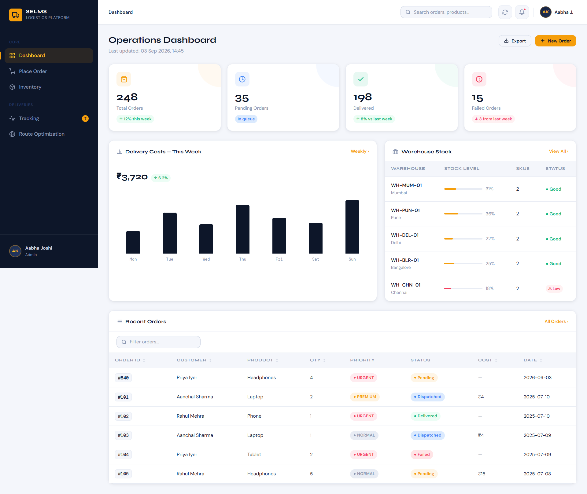
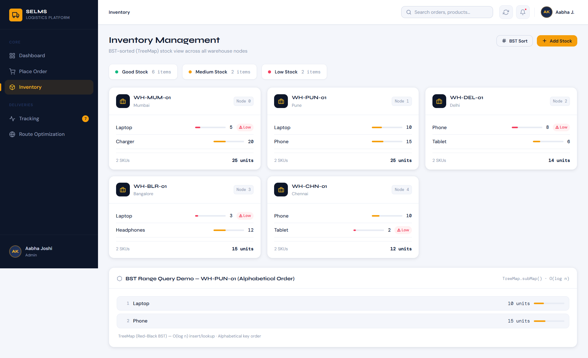
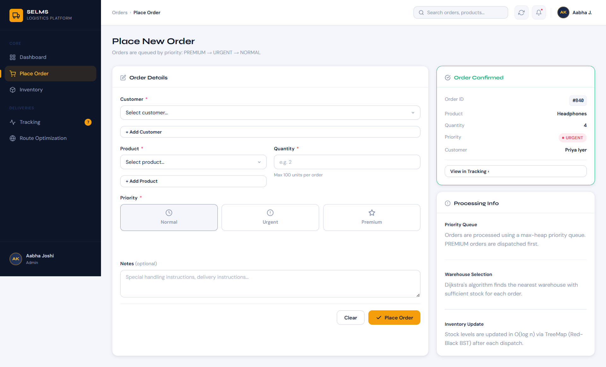
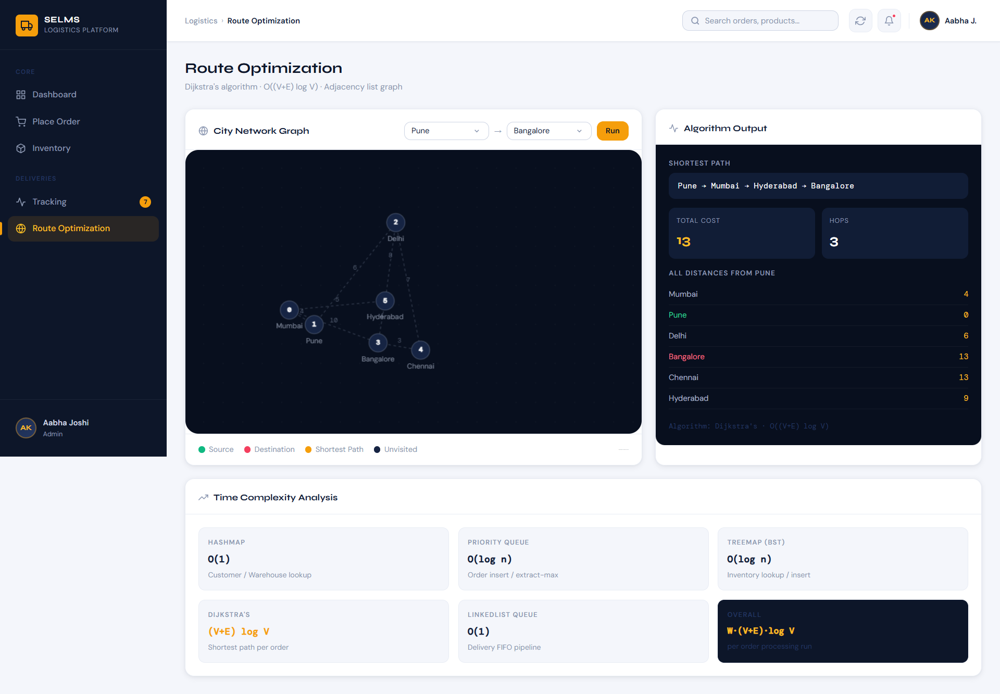
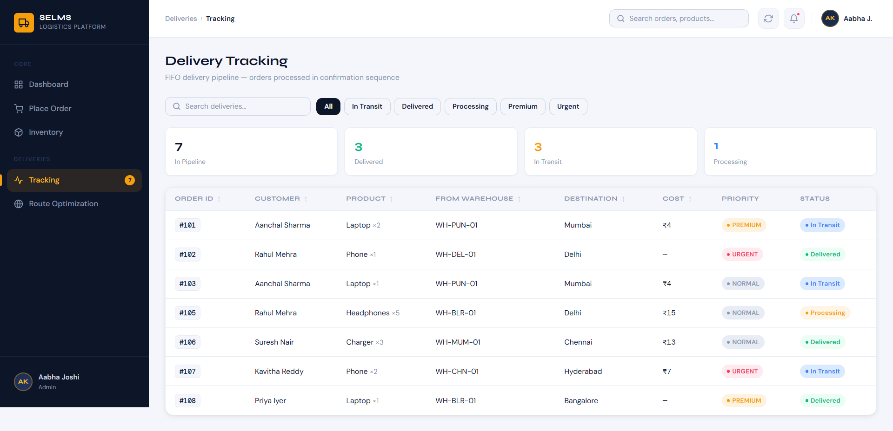

# Smart Enterprise Logistics & Order Processing System (SELMS)

> An enterprise logistics management platform built with Java and Spring Boot to optimize order processing, warehouse allocation, inventory management, and delivery route optimization using Data Structures and Algorithms.

## 🚀 Live Demo

[🌐 Launch SELMS](https://selms-727f0.containers.snapdeploy.app/#dashboard)

The application is publicly deployed and accessible through the live demo above.

---

## 📌 Project Overview

Smart Enterprise Logistics & Order Processing System (SELMS) is an enterprise-level logistics management platform designed to optimize:

- Order processing
- Warehouse allocation
- Inventory management
- Delivery route optimization
- Delivery tracking
- Dashboard analytics

The system simulates real-world logistics workflows similar to large-scale e-commerce and courier platforms such as Amazon, Flipkart, and DHL.

SELMS combines a Spring Boot backend with a Thymeleaf-based web interface and uses various Data Structures and Algorithms to efficiently model logistics operations.

---

## 🏷️ Domain

### Enterprise Systems & Process Optimization

The project focuses on optimizing enterprise-level logistics operations by automating:

- Order prioritization
- Warehouse allocation
- Inventory management
- Delivery route optimization
- Delivery processing
- Real-time tracking and analytics

The system aims to improve operational efficiency, reduce delivery costs, and enhance customer satisfaction in large-scale enterprise logistics environments.

---

## ✨ Key Features

### 👥 Customer Management

- Add and manage customers dynamically
- Fast customer lookup

### 📦 Product & Inventory Management

- Add and manage products
- Track inventory levels
- Update inventory dynamically
- Display warehouse inventory in sorted order

### 🚨 Priority-Based Order Processing

- Place new orders with priority levels
- Process orders based on priority

Priority order:

PREMIUM > URGENT > NORMAL

### 🏭 Warehouse Allocation

- Select an optimal warehouse based on:
  - Product availability
  - Inventory
  - Delivery route

### 🚚 Delivery Processing

- Delivery processing pipeline
- FIFO-based delivery management
- Shipment tracking

### 🗺️ Route Optimization

- Transportation network represented using a Graph
- Shortest / cheapest delivery route calculated using Dijkstra's Algorithm

### 📊 Dashboard & Analytics

- Dashboard overview
- Logistics performance visualization
- Operational insights

---

# 🧠 Data Structures & Algorithms

SELMS uses multiple Data Structures and Algorithms to model real-world logistics operations efficiently.

## 1. HashMap

Used for:

- Fast customer lookup
- Fast warehouse lookup
- City mapping

Time Complexity: O(1)

---

## 2. Priority Queue (Heap)

Used for:

- Processing high-priority orders first

Priority order:

PREMIUM > URGENT > NORMAL

Time Complexity: O(log n)

---

## 3. Graph (Adjacency List)

Used for:

- Representing the transportation network between cities
- Modeling connections between logistics locations

Time Complexity: O(V + E)

---

## 4. Dijkstra's Algorithm

Used for:

- Finding the shortest delivery route
- Finding the cheapest delivery route

Time Complexity: O((V + E) log V)

---

## 5. TreeMap (BST / Red-Black Tree)

Used for:

- Maintaining inventory in sorted order
- Performing range-based product queries

Time Complexity: O(log n)

---

## 6. Queue (FIFO)

Used for:

- Managing the delivery processing pipeline
- Maintaining first-in-first-out delivery processing

Time Complexity: O(1)

---

# ⚙️ Tech Stack

## Frontend

- HTML
- CSS
- JavaScript
- Thymeleaf

## Backend

- Java 17
- Spring Boot

## Build Tool

- Maven

## Deployment & DevOps

- Docker
- GitHub
- SnapDeploy

---

# 📂 Project Structure

```text
smart-enterprise-logistics-management-system/
│
├── src/
│   └── main/
│       ├── java/
│       │   └── com/example/selms/
│       │       ├── SelmsApplication.java
│       │       ├── HomeController.java
│       │       └── SmartLogisticsSystem.java
│       │
│       └── resources/
│           ├── static/
│           │   ├── css/
│           │   └── js/
│           │
│           ├── templates/
│           │   └── index.html
│           │
│           └── application.properties
│
├── .gitignore
├── Dockerfile
├── pom.xml
└── README.md
````

---

# 🚀 Getting Started

## Prerequisites

Make sure the following are installed:

* Java 17
* Maven
* Git

For Docker:

* Docker

---

## 1. Clone the Repository

```bash
git clone https://github.com/Aishwaryae31/smart-enterprise-logistics-management-system.git
```

Navigate into the project:

```bash
cd smart-enterprise-logistics-management-system
```

---

## 2. Build the Project

```bash
mvn clean package
```

To skip tests:

```bash
mvn clean package -DskipTests
```

The executable Spring Boot JAR will be generated inside the target directory.

---

## 3. Run the Application

```bash
mvn spring-boot:run
```

The application will start on the configured local port.

Open in your browser:

[http://localhost:8081](http://localhost:8081)

---

# 🐳 Running with Docker

## 1. Build the Docker Image

```bash
docker build -t selms .
```

## 2. Run the Container

```bash
docker run -p 8080:8080 selms
```

The application will then be available at:

[http://localhost:8080](http://localhost:8080)

---

# ☁️ Deployment

SELMS is containerized using Docker and deployed as a public web service using SnapDeploy.

### Deployment Pipeline

```text
GitHub Repository
       ↓
   Dockerfile
       ↓
 Docker Build
       ↓
 Spring Boot JAR
       ↓
   SnapDeploy
       ↓
 Public Web Application
```

### Live Application

[🌐 Open SELMS](https://selms-727f0.containers.snapdeploy.app/#dashboard)

---

# 📊 Complexity Analysis

| Operation        |       Complexity |
| ---------------- | ---------------: |
| Customer Lookup  |             O(1) |
| Warehouse Lookup |             O(1) |
| Order Insert     |         O(log n) |
| Order Process    |         O(log n) |
| Inventory Update |         O(log n) |
| Shortest Path    | O((V + E) log V) |

---

# 🌍 Real-World Applications

SELMS can be applied to:

* E-commerce logistics
* Warehouse management systems
* Supply chain optimization
* Courier and delivery services

### Example Use Cases

* Order prioritization in e-commerce
* Warehouse inventory management
* Delivery route optimization
* Shipment processing
* Logistics performance monitoring

---

# 👨‍💻 Team Members

* Aabha Joshi
* Aishwarya Marshettiwar
* Aanchal Hargunani

---

# 📌 Future Enhancements

Planned improvements include:

* Database integration using MySQL / MongoDB
* Real-time order notifications
* AI-based delivery prediction
* Secure login and authentication
* Live map API integration

---

# ⭐ Project Highlights

* Enterprise-oriented logistics workflow
* Multiple Data Structures and Algorithms
* Priority-based order processing
* Graph-based route optimization
* Dijkstra's shortest-path algorithm
* Dynamic inventory management
* Spring Boot backend
* Thymeleaf web interface
* Dockerized application
* Public cloud deployment

---

# 🔗 Links

* Live Demo: [https://selms-727f0.containers.snapdeploy.app/#dashboard](https://selms-727f0.containers.snapdeploy.app/#dashboard)
* GitHub Repository: [https://github.com/Aishwaryae31/smart-enterprise-logistics-management-system](https://github.com/Aishwaryae31/smart-enterprise-logistics-management-system)

---
# 📸 Screenshots

## Operations Dashboard

The main dashboard provides an overview of orders, delivery costs, warehouse stock, and recent logistics activity.



---

## Inventory Management

The inventory module provides a warehouse-wise stock view using TreeMap-based sorted inventory management.



---

## Order Processing

Orders can be created with different priority levels. The system processes orders using a priority queue with the following order:

PREMIUM > URGENT > NORMAL



---

## Route Optimization

The route optimization module represents the logistics network as a graph and uses Dijkstra's Algorithm to calculate the shortest delivery route.



---

## Delivery Tracking

The delivery tracking module manages shipments through a FIFO-based processing pipeline and provides real-time order status information.



## 📄 License

This project is intended for educational and demonstration purposes.


